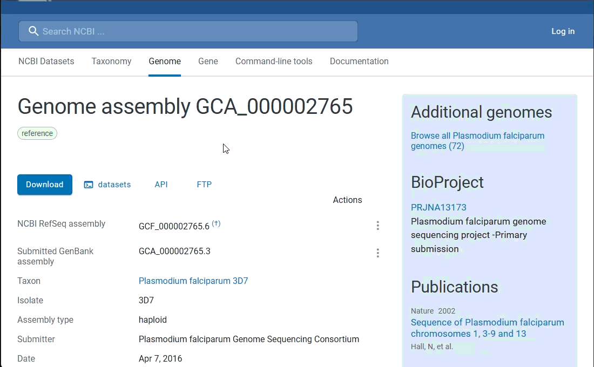
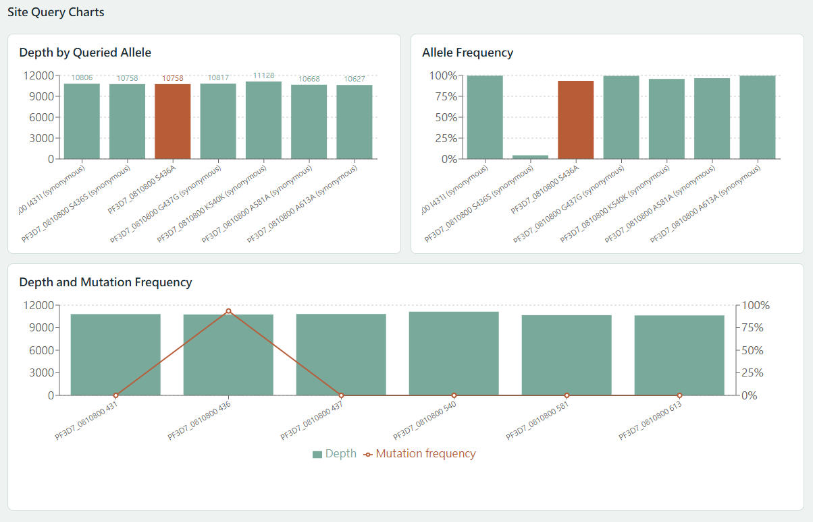

# Mutation Patrol Robot

Mutation Patrol Robot is a configurable parasite gene mutation browser. It
reports the variants and allele evidence observed at user-selected genes and
positions; it does not infer drug resistance or recommend treatment. The code
is split into two API-friendly Python operations:

1. Build a user-defined gene database from a reference genome.
2. Analyze sequencing samples against that database.

The UI can later call these two operations separately instead of running one
large, tightly coupled script.

## Quick Start

Recommended platform:

```text
Windows with WSL, Linux, or macOS with conda/bioconda
```

Native Windows Python is not recommended because the workflow calls Linux
bioinformatics tools.

For normal Windows + WSL use:

1. Download the project from GitHub:

```bash
git clone https://github.com/tanmanpp/Mutation_Patrol_Robot.git
```

   Or open [tanmanpp/Mutation_Patrol_Robot](https://github.com/tanmanpp/Mutation_Patrol_Robot)
   and choose **Code > Download ZIP**.

2. Install WSL and conda inside WSL. See [WSL_SETUP.md](WSL_SETUP.md).
3. Double-click:

```text
start_mutation_patrol_robot.bat
```

4. Open the web UI:

```text
http://localhost:8000
```

5. Build a gene database:
   - Download NCBI Datasets Gene **Product report JSONL** files.
   - Upload the reference FASTA.
   - Upload one or more product report `.jsonl` files.

6. Run sample analysis:
   - Select the gene database.
   - Upload exactly one FASTQ or BAM file.
   - Run analysis.

7. Inspect results:
   - Review mutation candidates.
   - Use Site Query for selected nucleotide or amino-acid positions.
   - View depth and mutation frequency charts.

## Web UI

The UI is scaffolded as a local web app:

```text
frontend/  React + Vite
backend/   FastAPI wrapper around the existing Python modules
```

Run the backend inside WSL so `samtools`, `bcftools`, and `minimap2` are
available as Linux command-line tools. See [WSL_SETUP.md](WSL_SETUP.md).

For normal Windows use, double-click:

```text
start_mutation_patrol_robot.bat
```

The batch file enters WSL, creates/uses a conda environment named
`mutation_patrol`, verifies every required runtime, builds the UI when needed,
and starts the app. You do not need to open a terminal or move to the project
folder first; the batch file detects its own location.

At every launch the preflight checks:

- Python 3.11 and the FastAPI backend packages
- Node.js and npm
- `samtools`, `bcftools`, and `minimap2`
- whether `environment.yml` or the backend requirements changed

The environment is created or synchronized automatically when necessary.
Dependencies are not reinstalled on every launch when the environment is
already current.

You can also start the whole app manually inside WSL:

```bash
bash scripts/run_app_wsl_conda.sh
```

Then open:

```text
http://localhost:8000
```

For development, you can still run backend and frontend separately:

```bash
bash scripts/run_backend_wsl.sh
bash scripts/run_frontend_wsl.sh
```

## Part 1: Build Gene Database

### Download NCBI Gene Product Report JSONL

The database builder expects an NCBI Datasets **Gene product report JSONL** file.

You can download it from:

[https://www.ncbi.nlm.nih.gov/datasets/genome/](https://www.ncbi.nlm.nih.gov/datasets/genome/)



Recommended download flow:

1. Search for the target gene of interest on the NCBI Datasets Gene page.
2. Open the gene result and use the download option.
3. Download the **Product report** file in **JSON Lines / JSONL** format.
4. Save the file as something descriptive, for example:

```text
annotations/crt.product_report.jsonl
annotations/mdr1.product_report.jsonl
annotations/dhps.product_report.jsonl
```

Use these `product_report.jsonl` files as the `--annotation` input when building
the gene database. Multiple per-gene JSONL files can be merged into one database
folder.

Build from one JSONL:

```bash
python build_gene_db.py \
  --ref_fasta reference/genome.fa \
  --annotation annotations/ncbi_product_report.jsonl \
  --out_dir databases/pf_amr_genes \
  --genes PF3D7_0810800 \
  --force
```

Build from several per-gene JSONL files:

```bash
python build_gene_db.py \
  --ref_fasta reference/genome.fa \
  --annotation annotations/dhps.jsonl annotations/crt.jsonl annotations/MDR1.jsonl \
  --out_dir databases/pf_amr_genes \
  --force
```

Build from a folder of per-gene JSONL files:

```bash
python build_gene_db.py \
  --ref_fasta reference/genome.fa \
  --annotation_dir annotations/amr_jsonl \
  --out_dir databases/pf_amr_genes \
  --force
```

This step locates user-selected target genes on the genome and exports:

- `gene_database.json`: structured database for API/UI/sample analysis
- `gene_database.csv`: human-readable gene summary
- `gene_regions.bed`: genomic intervals for ROI extraction
- `gene_cds.fna`: CDS nucleotide sequences
- `gene_proteins.faa`: translated amino-acid sequences
- `gene_database_warnings.txt`: non-fatal warnings, such as chromosome ID mismatches
- `build_gene_db.log`: build log
- `build_gene_db_metadata.json`: captured CLI arguments

The first version supports NCBI product report JSONL annotations. Each gene can
come from a separate JSONL file; the builder merges them into one database
folder. Each gene record stores chromosome, strand, exon coordinates, CDS
sequence, and translated protein sequence. Duplicate gene symbols are rejected
so the database remains unambiguous for API/UI use.

If an NCBI chromosome/accession ID does not exactly match the reference FASTA,
the builder first tries a version-insensitive match such as `NC_004329.3` to
`NC_004329`. If it can resolve the ID, it writes a warning and keeps building.
If it cannot resolve the ID, it still keeps the gene coordinates in the database
and BED, but marks the sequence as unavailable.

## Part 2: Analyze Sample

Entrypoint from one FASTQ file:

```bash
python analyze_sample.py \
  --gene_db databases/pf_amr_genes/gene_database.json \
  --fastq samples/sample_01.fastq.gz \
  --out_dir results/sample_01 \
  --threads 8 \
  --min_depth 10 \
  --min_alt_count 2 \
  --min_alt_freq 0.05 \
  --force
```

Entrypoint from a FASTQ folder:

```bash
python analyze_sample.py \
  --gene_db databases/pf_amr_genes/gene_database.json \
  --raw_dir samples/sample_01_fastq \
  --out_dir results/sample_01 \
  --threads 8 \
  --min_depth 10 \
  --force
```

Entrypoint from an existing BAM:

```bash
python analyze_sample.py \
  --gene_db databases/pf_amr_genes/gene_database.json \
  --input_bam results/sample_01/work/bam/merged.sorted.bam \
  --out_dir results/sample_01 \
  --threads 8 \
  --min_depth 10 \
  --force
```

This step maps reads if needed, extracts the database gene regions, scans BAM
pileups for non-reference alleles, and exports:

- `work/bam/merged.sorted.bam`
- `work/roi_bam/{gene}.bam`
- `tables/mutation_candidates.csv`
- `tables/sample_summary.csv`
- `tables/summary.json`
- `final_report.html` when exported from the Results page or `export_result_html.py`
- `analyze_sample.log`
- `analyze_sample_metadata.json`

By default, `mutation_candidates.csv` is generated directly from BAM pileup
(`--candidate_source bam`). It includes `ref_depth`, `alt_depth`, and
`allele_freq`, plus amino-acid annotation for SNVs when the allele falls inside
a database CDS exon. The older VCF-based path is still available with
`--candidate_source vcf`, which writes `work/vcf/{gene}.vcf.gz`.
`sample_summary.csv` includes one row per database gene and starts with the
`Gene name` column for UI display.

The web API copies an uploaded BAM to the analysis run's canonical
`work/bam/merged.sorted.bam` location, coordinate-sorts it, and creates its BAM
index automatically. The BAM must still use the same reference assembly and
contig identifiers as the selected gene database.

Export a final HTML report for one analysis output folder:

```bash
python export_result_html.py \
  --out_dir app_data/results/sample_01
```

This writes:

```text
app_data/results/sample_01/final_report.html
```

The HTML report includes the analysis summary, mutation candidates, all site
query tables, and simple depth/frequency charts. In the web UI, use
**Results > Export HTML Report** for the selected result.

## Scan a Whole Gene or Query Selected Sites

The web UI defaults to **Whole Gene Scan**. It examines the complete annotated
genomic interval from `gene_start` through `gene_end`, including intronic
positions, and reports every supported SNV, insertion, deletion, and
`MIXED_SIGNAL`. Reference-only positions are summarized rather than written as
thousands of table rows. Low-depth and uncovered positions are compressed into
`NO_CALL` regions so missing evidence remains visible.

Command-line whole-gene scan:

```bash
python query_sites.py \
  --gene_db databases/pf_amr_genes/gene_database.json \
  --bam results/sample_01/work/bam/merged.sorted.bam \
  --gene PF3D7_0810800 \
  --whole_gene \
  --min_depth 10 \
  --min_alt_freq 0.05 \
  --min_allele_count 2 \
  --out_csv results/sample_01/site_query/gene_scan/site_query.csv \
  --force
```

This writes:

```text
site_query.csv       supported variant allele rows
complete_gene_table.csv
                     every genomic position and reported allele row
scan_summary.json    callable, variant, mixed-signal, and NO_CALL counts
no_call_regions.csv  consecutive low-depth or uncovered intervals
```

The Results page previews the complete table and provides **Export Complete
CSV** for the untruncated file. Coding rows include:

- `region_type`: `CDS` or `NON_CODING`
- `effect`: reference, synonymous, missense, stop gained/lost, in-frame
  insertion/deletion, frameshift, non-coding variant, or no-call
- CDS and codon position
- reference and alternate codons
- one-letter amino-acid codes and amino-acid names
- formatted amino-acid change

The original targeted mode remains available when a user wants to inspect a
specific position even if it does not appear in the whole-gene scan.

Query one genomic position:

```bash
python query_sites.py \
  --gene_db databases/pf_amr_genes/gene_database.json \
  --bam results/sample_01/work/bam/merged.sorted.bam \
  --gene PF3D7_0810800 \
  --genomic_pos 548512 \
  --min_alt_freq 0.05 \
  --out_csv results/sample_01/tables/site_query.csv \
  --force
```

Query one CDS nucleotide position:

```bash
python query_sites.py \
  --gene_db databases/pf_amr_genes/gene_database.json \
  --bam results/sample_01/work/bam/merged.sorted.bam \
  --gene PF3D7_0810800 \
  --cds_pos 436 \
  --out_csv results/sample_01/tables/site_query.csv \
  --force
```

Query one amino-acid position. This outputs the three codon-base rows:

```bash
python query_sites.py \
  --gene_db databases/pf_amr_genes/gene_database.json \
  --bam results/sample_01/work/bam/merged.sorted.bam \
  --gene PF3D7_0810800 \
  --aa_pos 436 \
  --out_csv results/sample_01/tables/site_query.csv \
  --force
```

To check a specific allele even when it is absent, add `--alt`:

```bash
python query_sites.py \
  --gene_db databases/pf_amr_genes/gene_database.json \
  --bam results/sample_01/work/bam/merged.sorted.bam \
  --gene PF3D7_0810800 \
  --cds_pos 436 \
  --alt G \
  --out_csv results/sample_01/tables/site_query.csv \
  --force
```

The output uses the same columns as `mutation_candidates.csv`, including
`ref_depth`, `alt_depth`, strand depths, `allele_freq`, `allele_spectrum`,
`call_status`, and QC thresholds. A position must reach `--min_depth` (default
`10`) before it can be reported as `REFERENCE`, `VARIANT`, or `MIXED_SIGNAL`.
Positions below that threshold are reported as `NO_CALL` (`無法判斷`) with
`variant_type=NO_CALL`, never as a reference allele. `MIXED_SIGNAL` means that
two or more alleles meet both `--min_alt_freq` and `--min_allele_count`; it is
sequencing evidence and is not a diagnosis of mixed infection. Each row also
uses `allele_status=OBSERVED` or `NOT_OBSERVED` for the requested allele.

## Gene and Amplicon Coverage

Every new sample analysis produces coverage tables under:

```text
app_data/results/<run>/coverage/
```

The web UI **Coverage** page displays gene summaries, exon/target-region
summaries, and position-level depth charts. A database may optionally include
explicit `amplicons` entries for a gene; otherwise its exon regions are shown.
Coverage results include callable and `NO_CALL` base counts using the selected
minimum depth. They do not estimate or infer CNV.



## Requirements

The core analysis modules use the Python standard library. The web application
also installs the packages listed in `backend/requirements.txt`. The full sample
workflow expects these command-line tools:

- `bash`
- `minimap2`
- `samtools`
- `bcftools`

The supported environment is described in `environment.yml`. Run a manual
environment check after activating conda with:

```bash
python scripts/check_environment.py
```

## Background Jobs

Database builds, sample analyses, site queries, and coverage regeneration run
as background jobs.
The API remains responsive while a job is queued or running, and the web UI
polls the job status until it completes or fails. The default queue runs one
bioinformatics job at a time to avoid competing for memory and CPU. Advanced
users can change this with the `MPR_JOB_WORKERS` environment variable.

## Development Checks

Run the Python regression tests:

```bash
python -m unittest discover -s tests -v
```

Check and build the frontend:

```bash
cd frontend
npm ci
npm run build
```

GitHub Actions runs both checks for pushes and pull requests.

## Legacy Pipeline

`pipeline.py` remains available as a compatibility script, but new work should
prefer `build_gene_db.py` and `analyze_sample.py` because that split matches the
future API/UI design.
